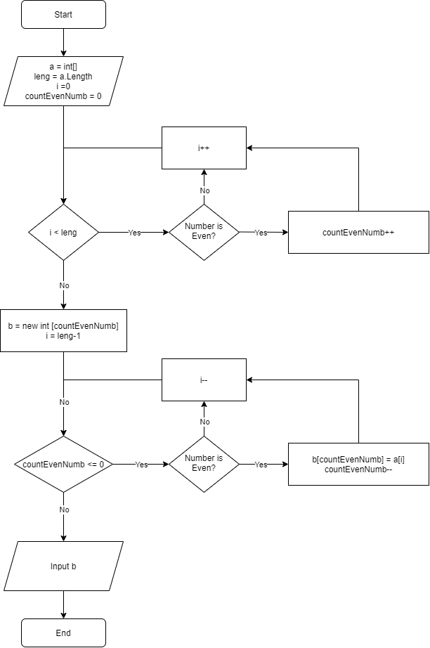

# Итоговое задание первой четверти по направлению "Разработчик"

## Задание

Задача алгоритмически не самая сложная, однако для полценного выполнения проверочной работы необходимо:
1. Создать репозиторий на GitHub
2. Нарисовать блок-схему алгоритма (можно обойтись блок-схемой основной содержательной части, если вы выделяете ее в отдельный метод)
3. Снабдить репозиторий оформленным текстовым описанием решения (файл README.md)
4. Написать программу, решающую поставленную задачу
5. Использовать контроль версий в работе над этим небольшим проектом (не должно быть так что все залито одним коммитом, как минимум этапы 2, 3 и 4 должны быть расположены в разных коммитах)

**Задача**: Написать программу, которая из имеющегося массива целых чисел формирует массив из четных чисел. Первоначальный массив можно ввести с клавиатуры, либо сгенерировать случайным образом. При решении не рекомендуется пользоваться коллекциями, лучше обойтись исключительно массивами.

**Примеры**:

[1, 2, 3, 4] -> [2, 4]

[1, 3, 4, 5, 7, 1, 3] -> [4]

[2, -4, 6] -> [2, -4, 6]

[1, 3, 5] -> []

## Решение 

***Блок-схема алгоритма***

